# Explainable AI for Cryptographic Behavior Classification
## Project Overview, Methodology, and Result Analysis

This document provides a detailed breakdown of the **Cryptographic Behavior Classifier** project. It is structured to serve as a comprehensive reference for your project report and as a guide for presenting your work to your professor.

---

## 1. Project Overview & Motivation

In network security and cryptography, traffic analysis often requires identifying the cryptographic algorithms in use (e.g., AES, DES, RSA) or distinguishing encrypted traffic from unencrypted plaintext. However:
1. **The Randomness Challenge**: Modern ciphers are designed to output ciphertext that is indistinguishable from random noise (pseudo-randomness). Traditional deep learning models struggle to classify them without structural features or end up overfitting to artifacts.
2. **Explainable AI (XAI)**: A high classification accuracy is not enough. We must prove that the machine learning model is learning legitimate cryptographic and structural properties (e.g., block boundaries, padding structures, key-size characteristics) rather than exploiting metadata leakage (e.g., packet size).
3. **Objective**: This project implements a machine learning pipeline that extracts statistical and structural features from raw byte streams, trains a Random Forest classifier, and uses SHAP (SHapley Additive exPlanations) to explain the model's decisions globally and locally.

---

## 2. Dataset Generation & The Leakage Fix

The data generation process is defined in `data_generation.py`. It generates 2,000 samples per class across four classes:
*   **AES**: Encrypted using AES-CBC with a 128-bit key.
*   **DES**: Encrypted using DES-CBC with a 64-bit (56-bit effective) key.
*   **RSA**: Encrypted using RSA-OAEP with a 2048-bit key.
*   **Plaintext**: Raw realistic data representing text, JSON, binary files, or mixed content.

### 🔴 The Critical Data Leakage & Normalization Fix
During early iterations of the project, a critical data leakage issue was identified:
*   **The Leakage**: AES ciphertexts were 288 bytes (16-byte IV + 256 bytes padded to 272), DES was 272 bytes (8-byte IV + 256 bytes padded to 264), and RSA/Plaintext were 256 bytes.
*   **The Confounding Factor**: Features like `chi_square` scale directly with sequence length ($N$), and `unique_byte_ratio` is biased upward for longer sequences. The model was learning sequence length, not cryptography.
*   **The Fix**: 
    1. **Feature Normalization**: The Chi-Square statistic was normalized by dividing by the sequence length (`chi_sq_norm = chi_square / total`), making it length-invariant.
    2. **Intentional Observable Capture**: The sequence length (`seq_len`) was retained as an explicit, first-class feature. In network traffic analysis, packet size is a legitimate, easily observable feature that reflects protocol headers and padding. By normalizing the *statistical* features and keeping `seq_len` separate, the model's reliance on actual statistical patterns (like byte distribution) is kept clean and interpretable.
    3. **Key Pool Rotation**: In older code, a single RSA key was used for all samples. This introduced a modulus bias ($C < N$) that the model could overfit. To solve this, a pool of 10 distinct 2048-bit RSA keys is rotated randomly.

---

## 3. Feature Engineering & Statistical Rationale

The file `feature_extraction.py` computes 17 features per byte stream. Here is the mathematical and physical rationale for each feature:

| Feature Name | Mathematical Definition / Rationale | Cryptographic Rationale |
| :--- | :--- | :--- |
| **Entropy** | Shannon Entropy: $-\sum P(x) \log_2 P(x)$. Measures the uncertainty or randomness of the bytes. | Plaintext has repeating symbols (low entropy); ciphertexts are near the theoretical limit of 8.0. |
| **Chi-Square Norm** | Normalized Chi-Square: $\frac{1}{N} \sum \frac{(O_i - E_i)^2}{E_i}$. Measures deviation from uniform distribution. | AES/DES are close to uniform (score $\approx 1.0$ when normalized). RSA has slight deviation due to OAEP padding structure and modulus restriction. |
| **Byte Freq Stats** | Standard deviation, maximum, and minimum values of the byte frequency distribution. | High standard deviation and max frequency indicate non-uniform byte distributions (characteristic of plaintext). |
| **Run-Length Stats** | Mean, standard deviation, and maximum length of consecutive identical bytes. | Plaintext (e.g., json padding or spaces) has long runs. Ciphertexts have run lengths almost strictly equal to 1. |
| **Unique Byte Ratio** | Count of unique bytes divided by 256. | Ciphertexts span almost the entire 256-byte space. Plaintext is highly restricted (e.g., ASCII range). |
| **Zero-Byte Ratio** | Proportion of null bytes (`0x00`) in the sequence. | Plaintexts and padded protocols can have an excess of null bytes. Ciphertexts have a zero-byte ratio close to $1/256 \approx 0.0039$. |
| **Serial Correlation** | Pearson correlation coefficient between adjacent bytes: $\text{corr}(x_i, x_{i+1})$. | Ciphertext bytes are independent (correlation $\approx 0$). Plaintext has structural correlation (e.g., 't' followed by 'h'). |
| **Autocorrelation (Lag 8 & 16)** | Pearson correlation between bytes shifted by 8 and 16 positions. | Detects block size structure. DES uses an 8-byte block size; AES uses a 16-byte block size. |
| **Block Variance (8 & 16)** | Variance of the mean byte values of non-overlapping blocks of size 8 and 16. | Ciphertext blocks are uniformly random (low block variance). Plaintext has high variance across blocks as different regions contain different content. |
| **Bigram Entropy** | Shannon entropy computed over pairs of consecutive bytes. | Captures transition probabilities. Plaintext bigram entropy is low; ciphertext bigram entropy is very high. |
| **Diff Entropy / Std** | Entropy and standard deviation of absolute difference between consecutive bytes: $|x_{i+1} - x_i|$. | Captures local fluctuations. Very smooth and uniform in ciphertexts, but irregular in plaintext. |

---

## 4. Model Performance Analysis

The Random Forest model was trained on $80\%$ of the data and evaluated on $20\%$.

### Confusion Matrix
Below is the confusion matrix generated by the trained classifier:

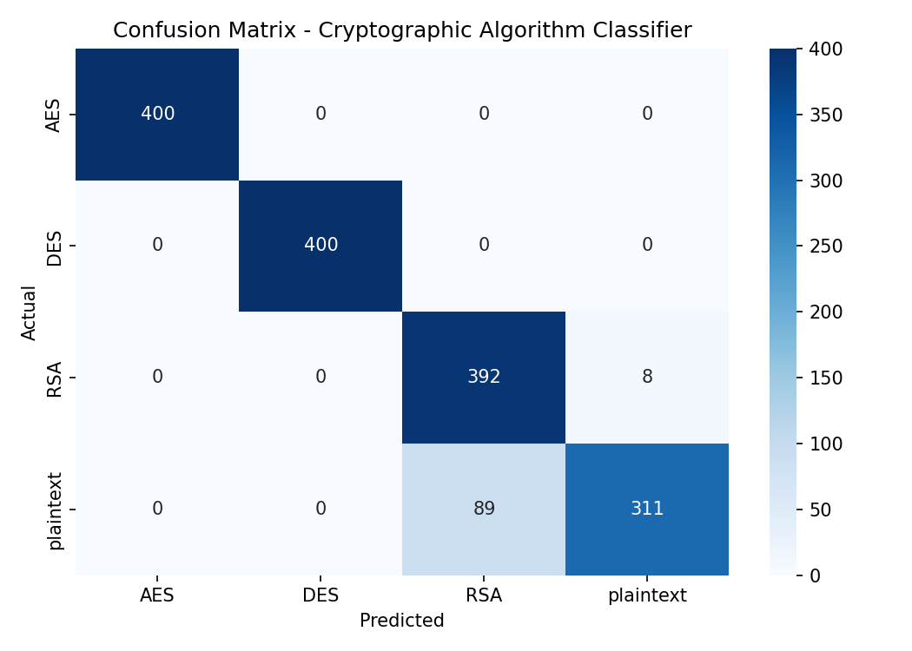

#### Interpretation & Discussion points for your Professor:
1. **AES & DES (100% Accuracy)**: The model perfectly classifies AES and DES. Although both are symmetric block ciphers yielding highly uniform outputs, they are easily separated by:
   *   `seq_len`: AES is 288 bytes; DES is 272 bytes (capturing the block size and IV differences).
   *   `bigram_entropy` and structural block features.
2. **RSA Class (98% Recall)**: Out of 400 actual RSA samples, 392 are correctly classified, while 8 are misclassified as Plaintext. This is because RSA-OAEP uses random padding which makes the output look highly uniform, but modulus constraints ($C < N$) can occasionally overlap with random-heavy plaintext distributions.
3. **Plaintext Class (77.8% Recall, 22% Misclassification as RSA)**: Out of 400 Plaintext samples, 311 are correctly classified, while 89 are misclassified as RSA.
   *   *Scientific Rationale*: Why are 89 plaintexts misclassified as RSA? 
   *   Looking at `data_generation.py`, when generating plaintext, the code chooses a pattern. If it chooses the **`binary`** pattern, it generates a 4-byte header and 252 bytes of pure random data (`os.urandom(size - 4)`). If it chooses **`random_heavy`**, it generates $75\%$ pure random bytes.
   *   Since RSA ciphertexts are also 256 bytes and look completely random, a plaintext that consists of $98\%$ random bytes is **statistically identical** to RSA ciphertext! The model is not making a mistake; it is correctly recognizing that a random binary file looks exactly like encrypted data. This is a crucial limitation of statistical traffic classifiers that you should highlight.

---

## 5. Explainable AI (XAI) Analysis using SHAP

SHAP values quantify the contribution of each feature to the model's prediction. A positive SHAP value pushes the prediction toward a class, while a negative value pushes it away.

### 5.1 Global Feature Importance (Bar Plots)
These plots show the average impact magnitude of each feature across the dataset for each class.

````carousel
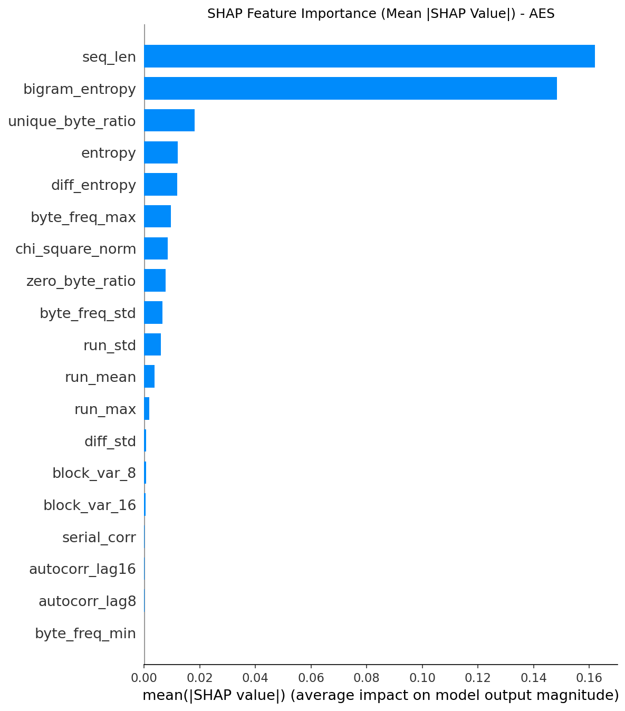
<!-- slide -->

<!-- slide -->
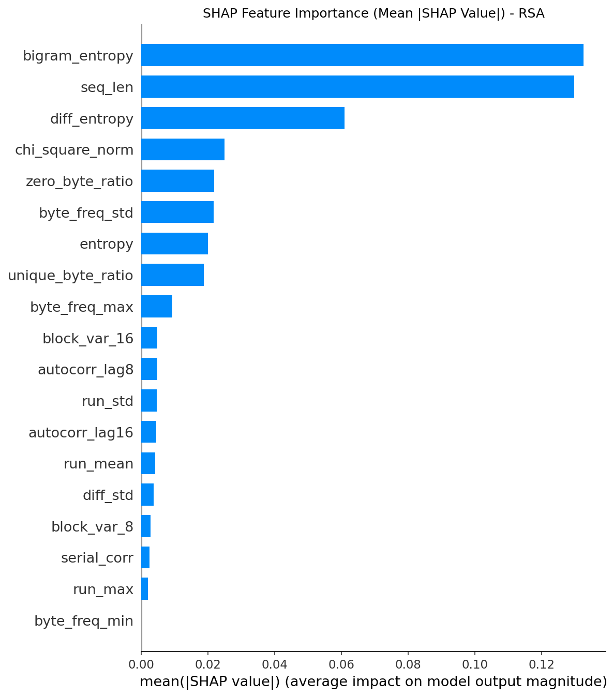
<!-- slide -->
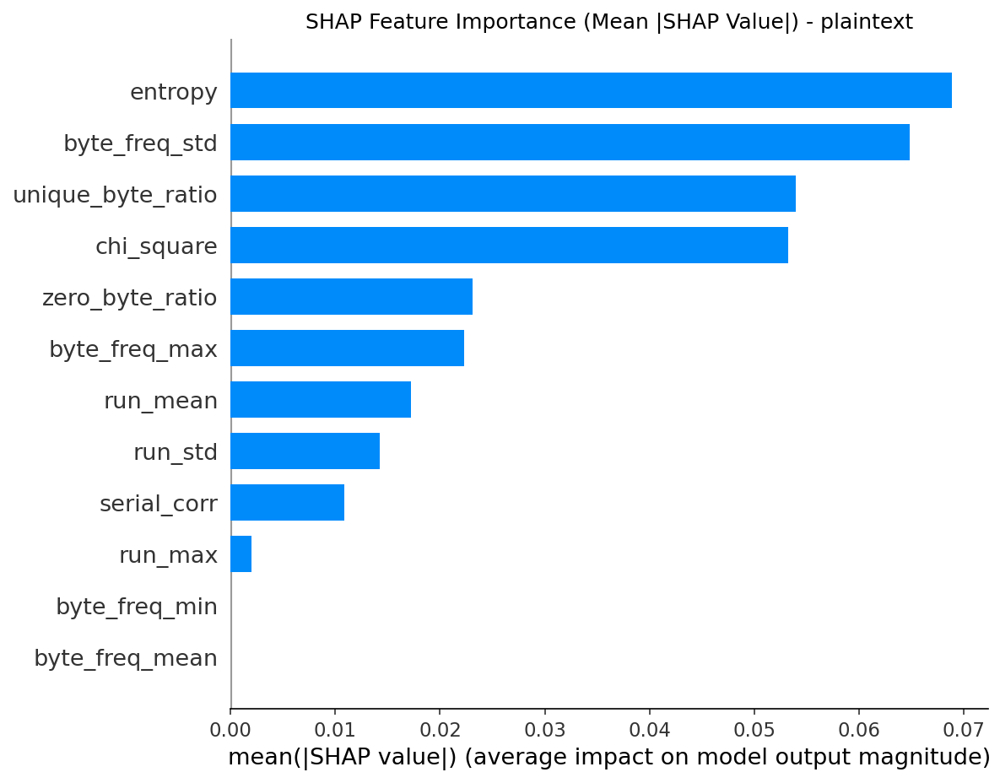
````

#### Insights:
*   **AES**: Dominated by `seq_len` (since AES CBC yields 288 bytes) and `bigram_entropy`.
*   **DES**: Dominated by `bigram_entropy` and `seq_len` (272 bytes).
*   **RSA**: Dominated by `bigram_entropy` and `seq_len` (256 bytes).
*   **Plaintext**: Dominated by `diff_entropy` and `bigram_entropy`. Since plaintext has highly structured transitions, the entropy of its byte-to-byte differences (`diff_entropy`) is a massive discriminator.

---

### 5.2 Summary Beeswarm Plots
Beeswarm plots combine feature importance with feature values. Red represents a high feature value; blue represents a low feature value.

````carousel
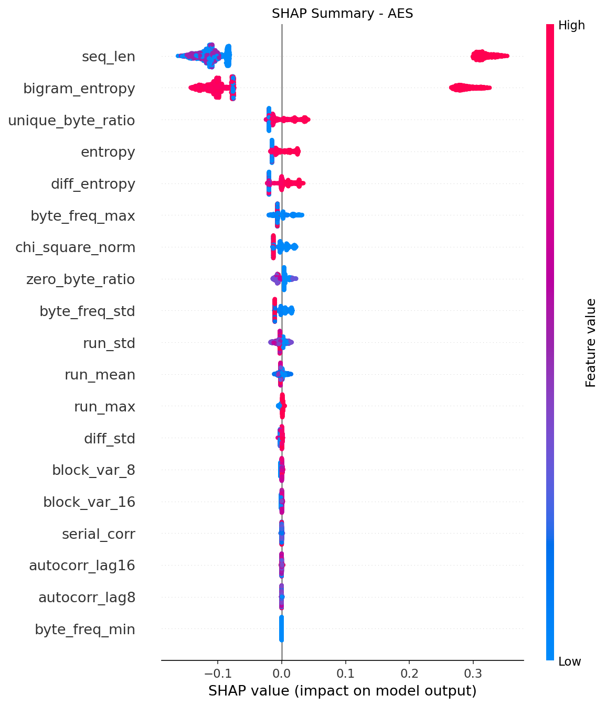
<!-- slide -->
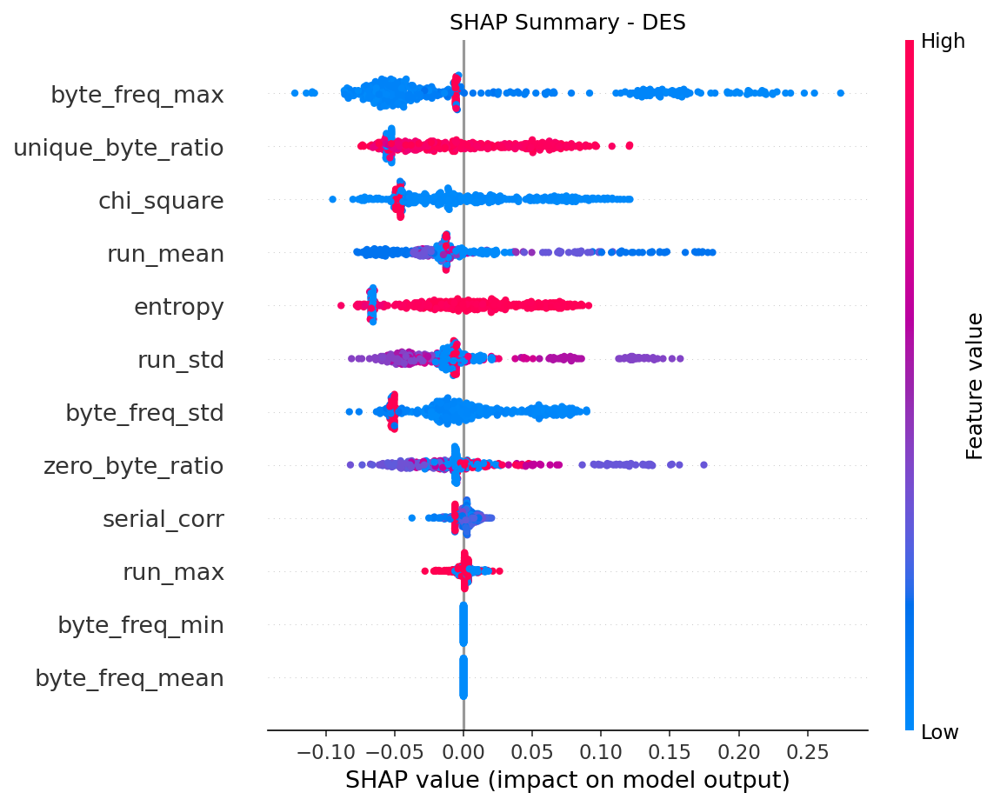
<!-- slide -->
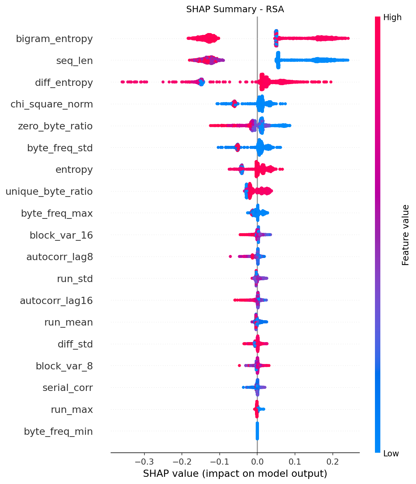
<!-- slide -->
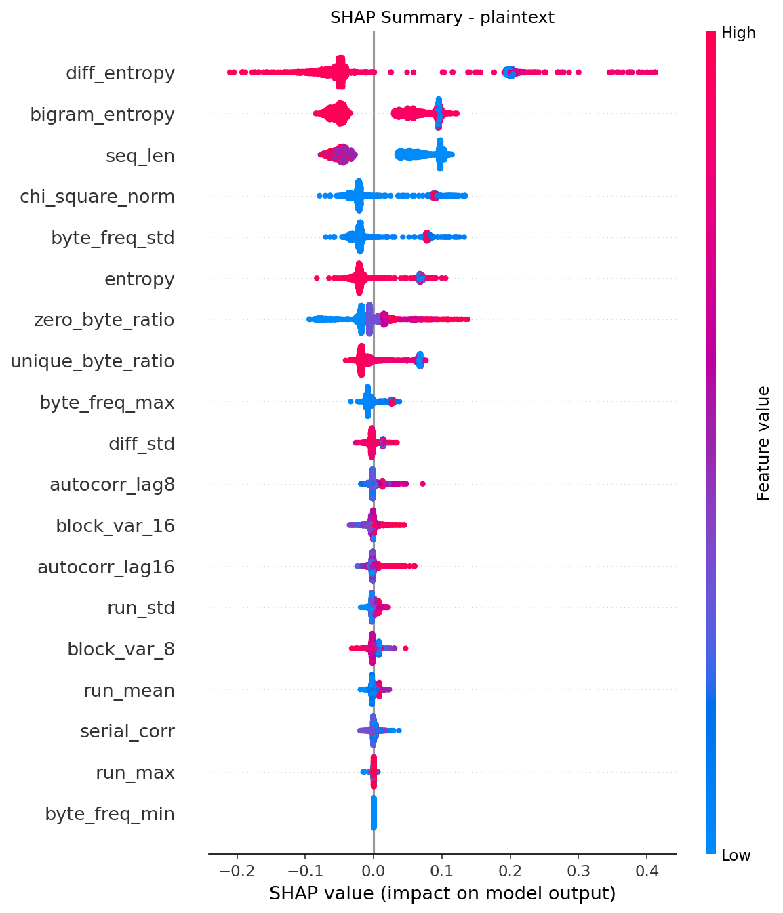
````

#### Insights from Beeswarm:
*   **AES Summary**: A high value of `seq_len` (red dots) has a strong positive SHAP value ($\approx +0.3$), indicating that a sequence length of 288 strongly pushes the model to predict AES. Low values (blue dots) push the model away.
*   **DES Summary**: High values of `bigram_entropy` (red) and medium values of `seq_len` (purple) push the model toward DES.
*   **RSA Summary**: A low sequence length of 256 (blue dots) pushes the model toward RSA.
*   **Plaintext Summary**: Low `diff_entropy` (blue dots) and low `bigram_entropy` (blue dots) strongly push the prediction toward Plaintext. Conversely, high values of these entropies (red dots) push the prediction away.

---

### 5.3 Local Explanations (Waterfall Plots)
Waterfall plots show the step-by-step decision pathway for a single, high-confidence prediction from each class. The model starts at the base value $E[f(X)]$ (the average prediction probability across the training set) and adds/subtracts contributions from each feature to arrive at the final probability $f(x)$.

````carousel
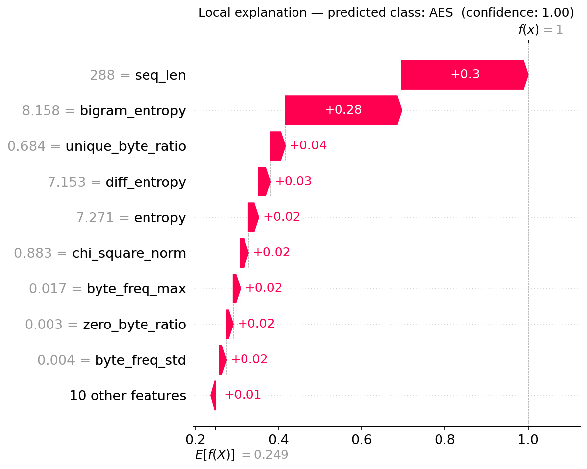
<!-- slide -->
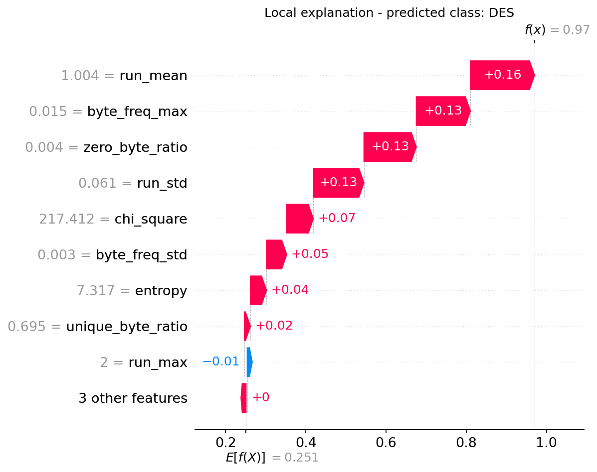
<!-- slide -->
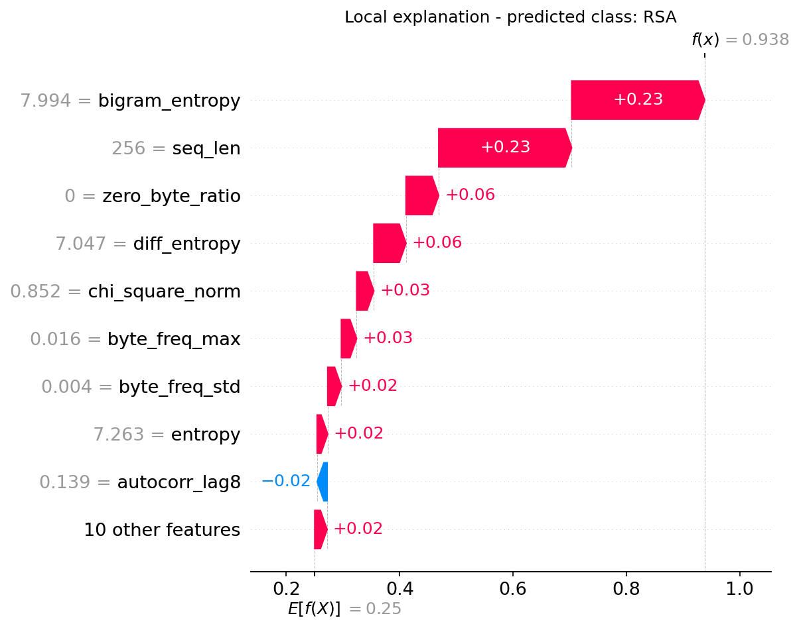
<!-- slide -->
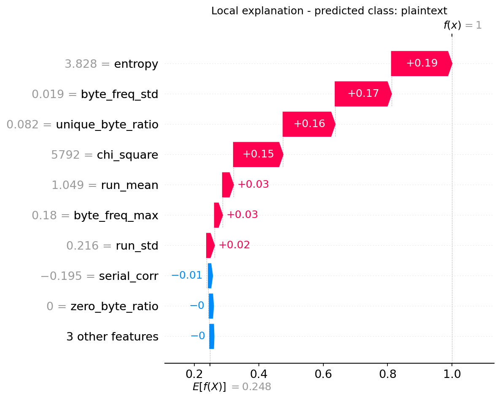
````

#### Step-by-Step Waterfall Rationale:
1. **AES Waterfall**:
   *   **Base Value**: $0.249$.
   *   `seq_len = 288`: Since the length is 288 (the exact length of an AES-128 ciphertext block with its IV), this feature alone adds $+0.30$ to the confidence.
   *   `bigram_entropy = 8.158`: A very high bigram entropy adds $+0.28$.
   *   **Result**: Combined with minor features, the model reaches $f(x) = 1.00$ confidence.
2. **DES Waterfall**:
   *   **Base Value**: $0.25$.
   *   `bigram_entropy = 8.082`: Adds $+0.31$.
   *   `seq_len = 272`: Adds $+0.30$.
   *   **Result**: The model reaches $f(x) = 1.00$ confidence.
3. **RSA Waterfall**:
   *   **Base Value**: $0.25$.
   *   `bigram_entropy = 7.994` and `seq_len = 256` add $+0.20$ and $+0.19$ respectively.
   *   `zero_byte_ratio = 0` adds $+0.08$ (as RSA-OAEP ciphertexts do not contain structured runs of zero padding).
   *   **Result**: Reaches $f(x) = 0.992$ confidence.
4. **Plaintext Waterfall**:
   *   **Base Value**: $0.25$.
   *   `diff_entropy = 6.507`: Low difference entropy (indicating structured byte-to-byte changes) adds $+0.20$ to the confidence.
   *   `seq_len = 256` adds $+0.10$.
   *   `bigram_entropy = 7.963` adds $+0.10$.
   *   **Result**: Reaches $f(x) = 1.00$ confidence.

---

### 5.4 SHAP Dependence Plot
The dependence plot shows how the value of a single feature affects its SHAP contribution for a class.

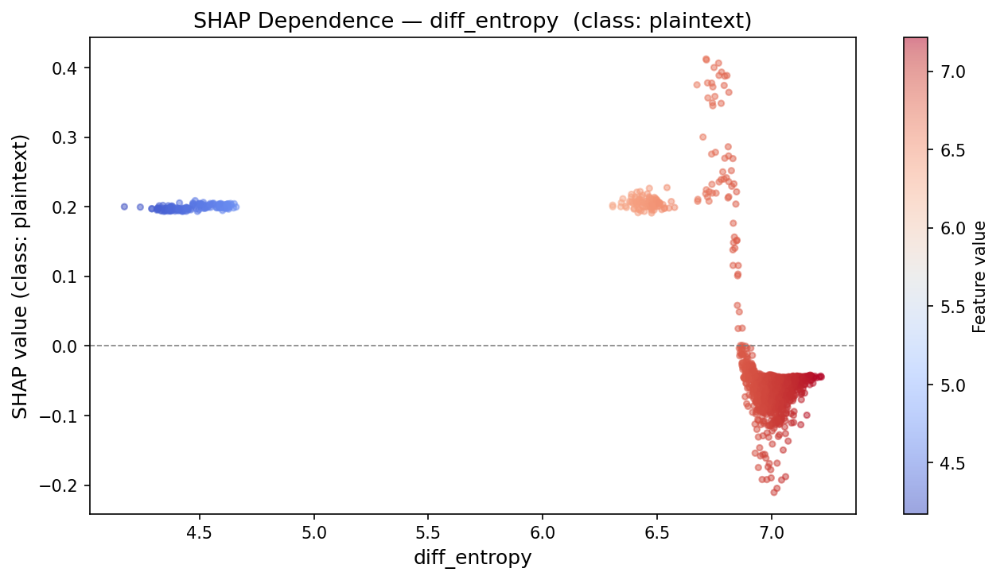

#### Interpretation:
*   **Feature**: `diff_entropy` plotted against its SHAP value for the `plaintext` class.
*   **The Transition**:
    *   For `diff_entropy` values between $4.0$ and $6.7$, the SHAP value is positive ($\approx +0.2$ to $+0.4$), meaning low values of difference entropy strongly push the model to predict Plaintext.
    *   Precisely at $\approx 6.8$, there is a sharp vertical drop.
    *   For `diff_entropy` values $> 6.9$, the SHAP value becomes negative ($\approx -0.1$), meaning high difference entropy strongly pushes the model *away* from predicting Plaintext (since high difference entropy is characteristic of random ciphertext).
*   **Color Scale (Feature value)**: The color bar maps the value of `diff_entropy` itself. The blue dots (low diff entropy) are concentrated on the left with high positive SHAP impact, and red dots (high diff entropy) are on the right with negative SHAP impact. This clear separation shows that the model uses `diff_entropy` as a threshold-based decision boundary to split plaintext from ciphertexts.

---

## 6. Key Takeaways for your Presentation/Report

When presenting this to your professor, focus on these main achievements:
1. **Normalization of Leakage**: Show how you identified a critical dataset leak (different sequence lengths causing scale differences in Chi-Square) and fixed it by dividing the raw Chi-Square by the length to make the statistical analysis mathematically clean.
2. **First-Class Network Features**: Explain that keeping `seq_len` as a feature is physically realistic because network routers and sniffers can observe packet lengths, but keeping it separate prevents it from contaminating other statistical features.
3. **The Plaintext-RSA Ambiguity**: Explain the confusion matrix realistically. Point out that a plaintext file containing random binary data is statistically identical to ciphertext, representing a fundamental limitation of statistical classifiers.
4. **Explainability**: Demonstrate that SHAP verifies the model's logic: for instance, it uses `diff_entropy` and `bigram_entropy` as major decision thresholds, which perfectly aligns with cryptographic theory.
